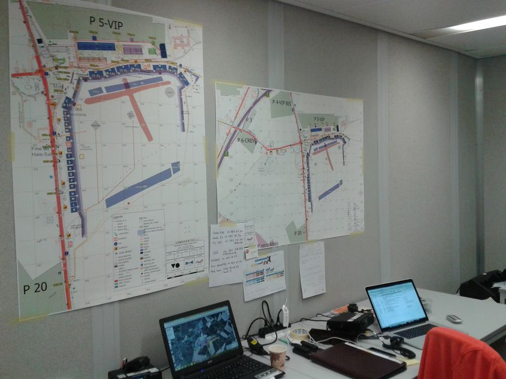

Jul 2015

	
Waterloo 2015 case

	
200.000 people on three days to remember the battle of Waterloo

	

	
	
live Poppy maps in the command and control room ...

	

	

	
	
... night and day ...

	

	

	
	
with multiple fallback systems: redundant servers, local server, USB keys, task-adapted printed maps

	

	

	

	

	

	
a full service on the field, and a companion app

	

