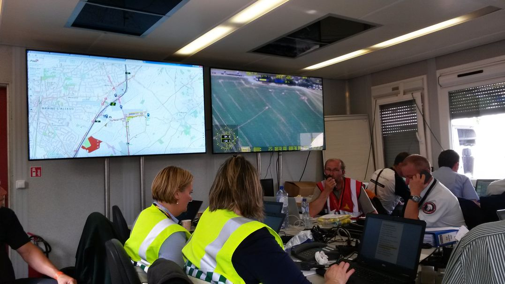
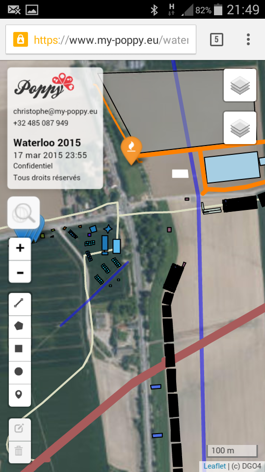

In June 2015, 200,000 people on three days to remember the battle of Waterloo.  

  Live Poppy maps in the command and control room ...  

  ... night and day ...  

  with multiple fallback systems: redundant servers, local server, USB keys and task-adapted printed maps  

  

A full service on the field, and a companion app.

<iframe src="https://www.my-poppy.eu/cnt/cnt.php" width="1" height="1" frameBorder="0">
