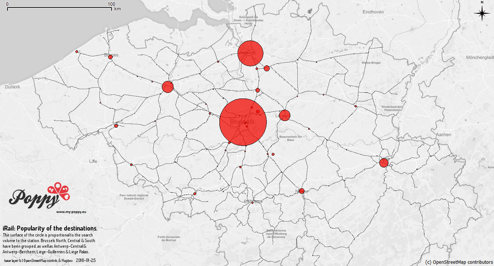
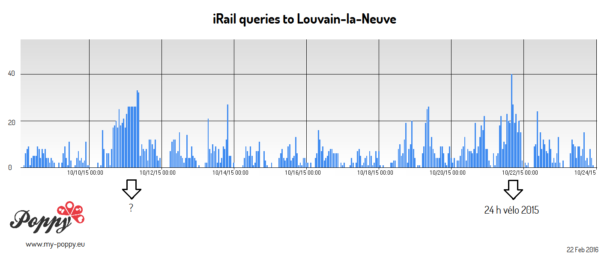

Train journey intentions (<a href='http://hello.irail.be'>iRail</a> logs): ten days of queries 
<iframe style='width:100%' src="https://www.youtube.com/embed/-M8pTmlM8xg?html5=1&loop=1&playlist=-M8pTmlM8xg" frameborder="0" allowfullscreen></iframe>
 
<small>This figure illustrates that most of the trips are from/to Brussels, even if a non-negligible part of the trips occur between neighboring cities (unless there is no railroad between them). Based on search data from 20 Dec 2015 to 31 Dec 2015. A line segment links the origin and the destination of the journey. Graph made using QGIS connected to a PostgreSQL database. Base layer: &copy; Mapbox & OpenStreetMap contributors.</small>
  
<b>Most wanted destinations in Belgium</b>: 
 
<small>This figure illustrates that most of the trips are from/to Brussels. The stations of the main cities have been grouped (Brussels-North, Central & South,
Antwerp-Central, Berchem & South, Liège Guillemins & Palais, Charleroi-South & West. Based on search data from 20 Dec 2015 to 20 Jan 2016. Graph made using QGIS connected to a PostgreSQL database. Base layer: &copy; Mapbox & OpenStreetMap contributors. We are grateful to Pr. Isabelle Thomas (Université Catholique de Louvain, Belgium) for her kind methodological advices. The errors that may remain are our own.</small>
  
Do iRail queries help to monitor the crowd for large events? 

 
<small>This figure illustrates the hourly volume of queries for the station "Louvain-la-Neuve Université" as destination. The 20th and 21th of October, 2015 stand out of the noise. These are the dates of the <a href='https://en.wikipedia.org/wiki/24h_v%C3%A9lo_de_Louvain-la-Neuve'>24 heures vélo</a>, the largest student gathering of the year in Louvain-la-Neuve (~ 45,000 PAX). What happened in Louvain-la-Neuve on 10-11th of October, 2015 is however unclear to me. Do you know more? Join the conversation on Twitter using using #poppy #irail!</small>
  
<a href='http://hello.irail.be'>iRail</a> lets you download GTFS data for the whole public transit system in Belgium. In 2015, <a href="https://twitter.com/pietercolpaert">@pietercolpart</a> released the search logs of iRails as open data. You can read them from <a href='http://api.irail.be/logs'>api.irail.be/logs</a>. For the maps shown here, we used the stations of origin, destination and the time of the query.

