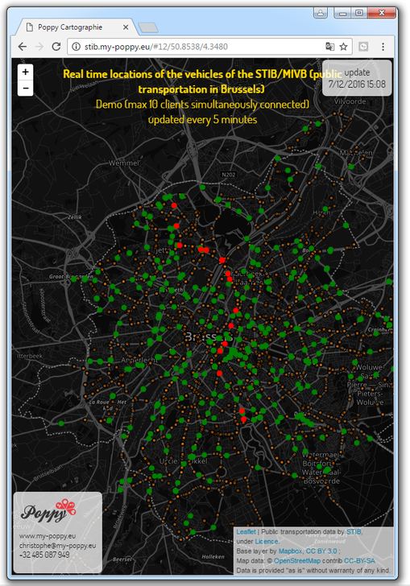

<b>Real time location of Brussels public transportation</b> The first app using the STIB-MIVB open data

On ..., the public transportation company of Brussels (<a href='https://opendata.stib-mivb.be/store/'>STIB-MIVB</a>) released for the first time their <a href='https://opendata.stib-mivb.be/store/'>data</a>, including real time data, under an open licence. We took it as a challenge and one day later, we released the first <a href='http://stib.my-poppy.eu'>app</a> based on these data.

It shows the real time location of the surface & underground vehicles, updated every three minutes.

Technically, the data is hosted on a public web hosting, which cannot get periodical updates over the network (using 'cron' & 'curl'). We then implemented a small cache mechanism: at each query of the data by the webpages, the script on the server checks if the data is enough up to date. If not, the new data the server retrieves the data from the STIB-MIVB portal.
