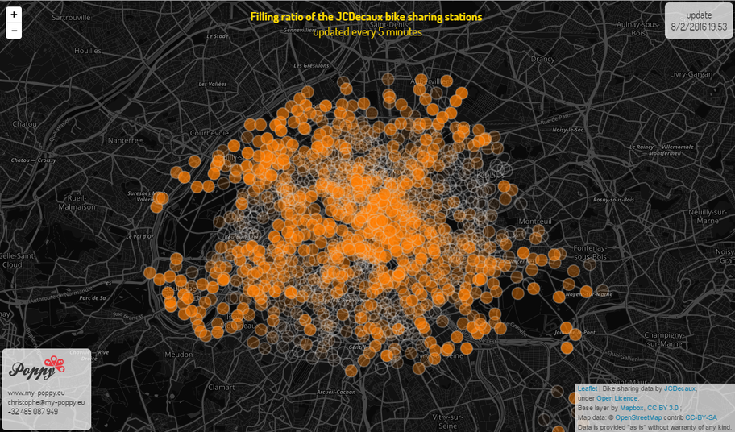

Open <a href='http://www.my-poppy.eu/bikes'>bike sharing</a> data: can they be used to monitor the city? 
<iframe width="560" height="315" src="https://www.youtube.com/embed/h-9Gxtj9Fok?html5=1&loop=1&playlist=h-9Gxtj9Fok" frameborder="0" allowfullscreen></iframe>
<small>
The pulse of Paris based on real time bike sharing data by <a href="http://developer.jcdecaux.com">JCDecaux</a> from 2016-02-10 to 2016-02-16.
</small>  
At first sight, we could assume that people are where the stations are full. However some factors should be taken into account, such as the rebalancing, the use of the bikes to reach a station to continue the journey, or the difficulty of uphill trips. Could therefore such data be used to monitor the city? Could we build a model? What are the limitations? Join the conversation on Twitter using #poppy #bikesharing !
  

See it in real time on <a href="http://www.my-poppy.eu/bikes">http://www.my-poppy.eu/bike</a>:  

<small>  
Based on real time bike sharing data by <a href="http://developer.jcdecaux.com">JCDecaux</a> from 2016-02-10 to 2016-02-16.</small>

<iframe src="https://www.my-poppy.eu/cnt/cnt.php" width="1" height="1" frameBorder="0">
