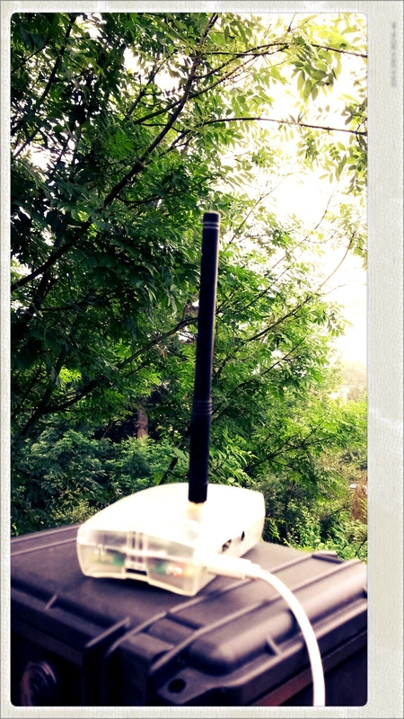

<b>Geolocation without GPS</b>, transmitted to your server without GSM nor Wi-Fi 

  

At Poppy, we craft solutions tailored to your needs. You probably ever dreamt of geolocation in obstructed environments when no reliable GPS signal is received, and want your battery last a long time so that you can not use the GSM network to transmit the data.
It is kind of magic, but by combining a <a href='https://unwiredlabs.com/'>database of Wi-Fi access points</a> with the long range-low power <a href='http://www.sigfox.com/en/coverage'>Sigfox network</a>, you get a geolocation device that knows where you are without the need of a GPS device, and transmits your location to a server without GSM nor Wi-Fi connection. Ten minutes after you power your computer, you get the first geolocation report, which is then updated every 6 times per hour.  

<a href='https://github.com/ccloquet/sigfox-wifi-geoloc'>Check out on Github</a> & contribute!
 
