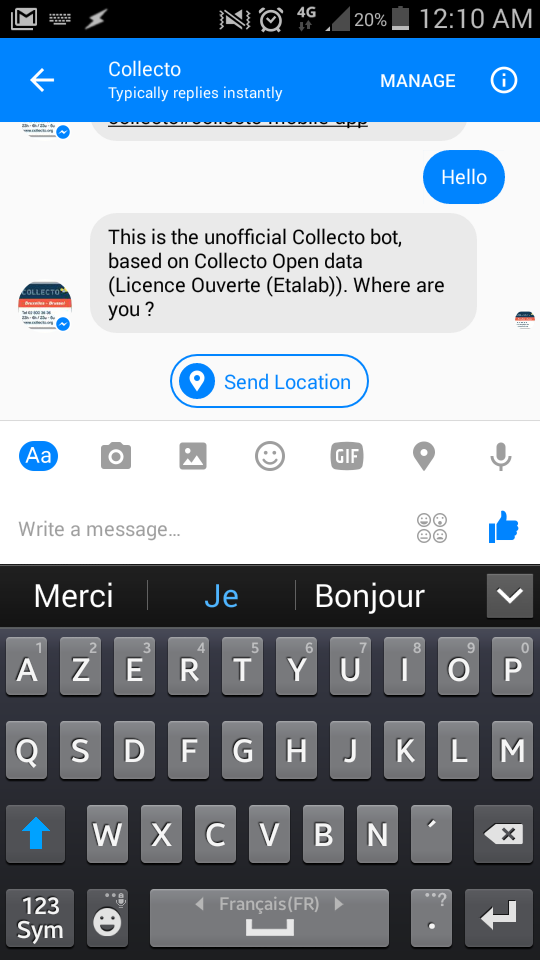
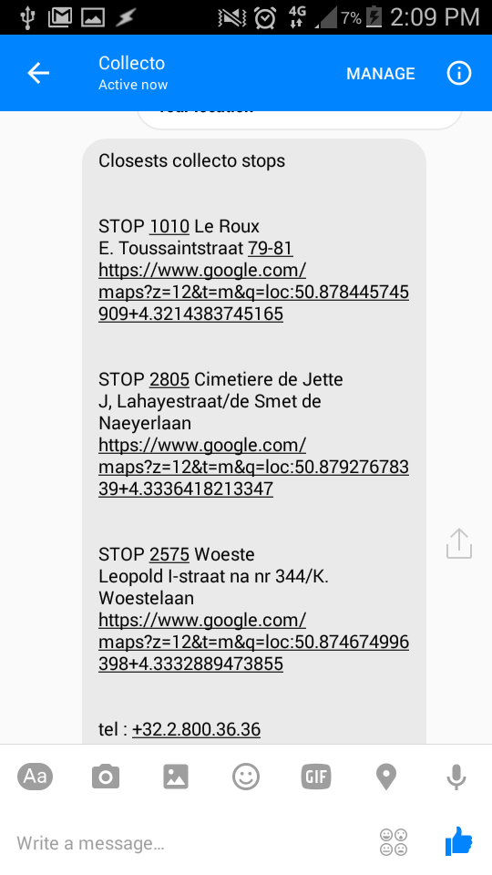

Transportation data are an endless source of inspiration for demos of services that might be useful for emergency management. In this post, I give a glimpse on the possibilities of chat bots, based on Open Data about Brussels shared taxis. When you are in a hurry and need a short piece of information, you need simple tools to quickly get the answer. Chat bots provide an easy way to build data-based services without worrying too much about the interface. Being based on messaging apps, they moreover take advantage of their resilience to network glitches, including slow bandwidth connexions, which is ideal in disaster settings. As a demo of such capabilities, we built a simple chatbot using <a href='https://opendata.bruxelles.be/explore/dataset/arrets-collecto0/'>Collecto Open Data</a>. The <a href='http://www.taxisverts.be/collecto'>Collecto</a> service is a shared taxis service in the Brussels Capital Region operated at night by <a href='http://www.taxisverts.be/'>Taxis Verts</a> in collaboration with the <a href='http://www.stib-mivb.be'>STIB/MIVB</a> and <a href='http://www.bruxellesmobilite.irisnet.be/'>Mobiris</a>. 

&nbsp;

 
The bot, accessible on Facebook Messenger under the name <a href='https://www.facebook.com/Collecto-Test-Bot-1219687344797226'>"Collecto Test Bot"</a> allows to determine the two closest stops, their IDs and walking time. Greet the bot by writing "hello", or whatever you prefer, then press the button to share your location. You will receive a list of the three closest stops, a Google Maps link to locate them more easily and the phone number to call in order to book the taxi. The data are not used for anything else than to provide the service. Erasing of the data currently involves a human operation as Facebook does not provide an automated procedure. Many improvements can be thought of, such as the detection of the customer's language, a direct link to order the taxi, and updates about the taxi location.
		 
