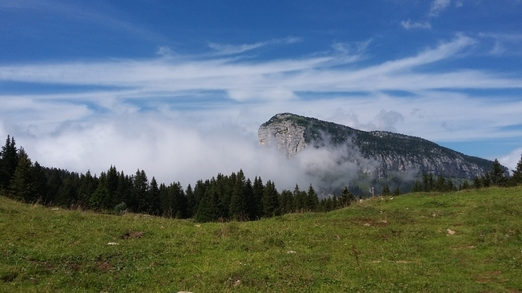

Mount Granier, Chartreuse, France. C. Cloquet (2017). lic <a href='https://creativecommons.org/licenses/by/2.0/'>CC BY 2.0</a>
 

When hiking in the mountains, the weather remains a critical parameter, both to enjoy your walk and for security reasons. Having been caught in bad wather in the wonderful Chartreuse (France) this summer, I would have needed to rely on hourly weather forecasts to decide when it was the most appropriate moment to start hiking to have a reasonable chance to safely cross the next pass.  

What is evident at home often becomes difficult in remote areas. Internet access is often excluded, be it in 4G or in Edge mode. Most of the time, when you get a GSM signal, it is more likely to be 2G, allowing you to send text messages, but nothing more.

  
The idea was then to design a microservice that would serve an hourly weather forecast to hikers for the next 48 hours. To this end, I wrote a small <a href='https://github.com/ccloquet/mountain'>php script</a> that queries <a href="https://www.wunderground.com/">Weather Underground</a>. The source code is freely available on <a href='https://github.com/ccloquet/mountain'>GitHub</a>, and here is an <a href='https://mountain.my-poppy.eu/weather.php?Body=meteo,grenoble,france'>example</a> of the results. Note that if the pressure and weather conditions stay the same from hour to hour, they are not repeated.  

This versatile script can be hosted on any php-friendly platform (eg: <a href='https://www.heroku.com/'>Heroku</a> or <a href='https://www.fortrabbit.com'>Fortrabbit</a>).
After having configured it with the API KEY obtained from Weather Underground (just paste it at the appropriate place in the script), it might be used as the <a href='https://www.twilio.com/blog/2016/08/receive-sms-php-twilio.html'> webhook of a Twilio SMS number</a>.

  

Using the script is as easy as 1-2-3 : just send, say "meteo,Grenoble,France" to your Twilio number, and you will receive your detailed forecast. When Hiking in France, you can even omit the country.  

The results are automated forecasts, and do not replace the expertise of a skilled meteorologist or trained high mountain guide. Use it at your own risks!  

Are there are hikers among you? How are you getting the weather forecasts when in the middle of nowhere? Does this service adress a need? Any other ideas?  

If it is useful, we can discuss about setting up a common Twilio number, to avoid the burden of setting up your own. We would then need to find an efficient way to cover the expenses, as the amounts are small.
Perhaps we could link it to a pre-paid credit card, that people going to hike would provision with, say, 10 euros, before going to hike. Just get in touch if you have other ideas!
