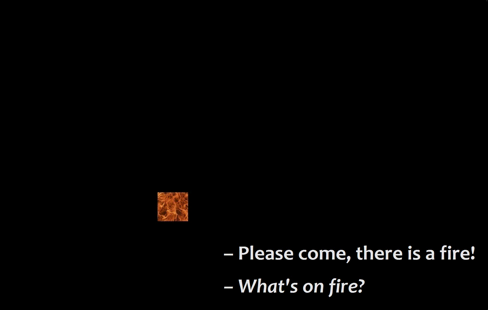

 
En visite dans une centrale <a href='https://112.be'>112</a> il y a quelques semaines, je me suis demandé comment aider les call takers à évaluer la situation d'urgence des personnes qui appellent. Ce serait mieux s'ils pouvaient voir directement ce qui se passe, non ? C'est comme cela qu'est né <a href='https://showme.my-poppy.eu'>ShowMe</a>, dont le fonctionnement est tout simple :  <b>1.</b> le/la call taker envoie par SMS un lien à l'appelant.e ;  <b>2.</b> l'appelant.e allume sa 4G ou son Wifi et clique sur le lien. 

À partir de là, un flux vidéo est envoyé directement au dispatching .

 
Le projet est open source sur <a href='https://github.com/ccloquet/showme'>GitHub</a>. À l'instar de <a href='https://github.com/laudeco'>@laudeco</a>, chacun peut y contribuer ou le télécharger pour l'installer lui-même. 

Idéalement, le système existerait sous 2 formes : l'une intégrée à l'<a href='https://www.112.be/fr/app'>App 112 BE</a> et l'autre sous forme de lien, pour les visiteurs étrangers ou les personnes n'ayant pas pré-installé l'application, et dans l'attente d'une <a href=''>application européenne</a>. Un contributeur du forum <a href=''>Secours 112</a> a même suggéré qu'une telle app s'ouvre automatiquement lorsqu'un numéro d'urgence est formé (poke @ Google & Apple). L'expérience acquise par <a href='ShowMe'>https://showme.my-poppy.eu</a> pourrait également bénéficier à d'autres projets comme <a href='https://twitter.com/geoloc18_112'>Geoloc_18_112</a> ou <a href='https://www.senat.fr/questions/base/2018/qSEQ180706234.html'>NexSIS</a> par exemple.  

Testez aussi <a href='https://112.camera'>112.camera</a>. Le principe est le même, sauf que c'est vous qui prenez l'initiative de filmer et de le faire savoir au 112. Concrètement, lors de votre appel, vous signalez au call taker que vous allez lui envoyer une vidéo en streaming à l'adresse <b>112.camera/votre-numero-de-telephone</b> (ex: 112.camera/32412345678). Ensuite, vous ouvrez <a href='https://112.camera'>112.camera</a>, entrez votre numéro de téléphone et appuyez sur GO. Dès que la communication est établie, votre smartphone commence à filmer et les images sont transmises. 

Ce projet est également open source, disponible sur <a href='https://github.com/ccloquet/112.camera/'>GitHub</a>.

Qu'en pensez-vous ? Avez-vous d'autres idées ? Tweetez <a href='https://twitter.com/mypoppy_eu'>@mypoppy_eu</a> ou partagez vos idées sur GitHub ou via <a href='https://facebook.com/mypoppyeu'>Facebook</a> !

<iframe src="https://www.my-poppy.eu/cnt/cnt.php" width="1" height="1" frameBorder="0">
