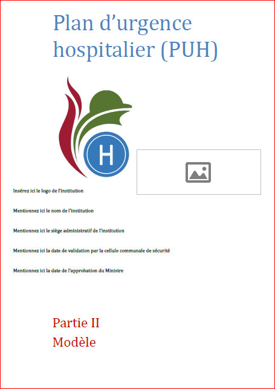
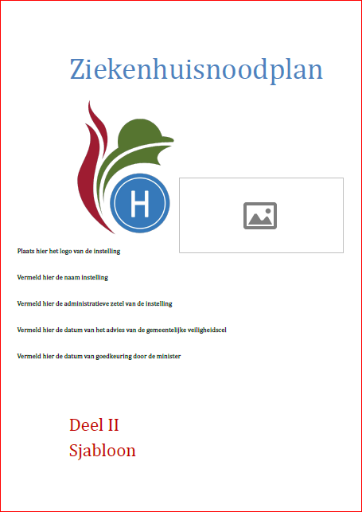

&nbsp;

 
Dans le cadre du plan d'urgence hospitalier, le SPF santé publique met à disposition plusieurs outils, dont un canevas de PUH (<a href="https://www.plandurgencehospitalier.be">plandurgencehospitalier.be</a>).
Lorsque le SPF publie une nouvelle version du canevas, vos données ne sont pas perdues ! Vous pouvez les copier de l'ancien fichier vers le nouveau fichier de la façon suivante : 
<ol type="a">
<li>Pour <b>exporter</b> les données d'un ancien formulaire : 
<ol>
<li>Ouvrez votre formulaire avec Acrobat Pro</li>
<li>Cliquez sur "Prepare Form"</li>
<li>Cliquez sur "More"</li>
<li>Cliquez sur "Export Data"</li>
<li>Entrez un nom de fichier (format : Adobe FDF Files)</li>
<li>Cliquez sur "Save"</li>
</ol>
 
</li>
<li>Pour <b>importer</b> les données dans le nouveau formulaire:
<ol>
<li>Ouvrez votre formulaire avec Acrobat Pro</li>
<li>Cliquez sur "Prepare Form"</li>
<li>Cliquez sur "More"</li>
<li>Cliquez sur "Import Data"</li>
<li>Choisissez le fichier .fdf sauvegardé à l'étape précédente</li>
<li>Sauvegardez votre formulaire</li>
</ol>
</li>
</ol>
 
Avez-vous des questions ? Nous vous aidons volontiers ! Contactez-nous via : <a href="mailto:info@my-poppy.eu">info@my-poppy.eu</a>

<iframe src="https://www.my-poppy.eu/cnt/cnt.php" width="1" height="1" frameBorder="0">

