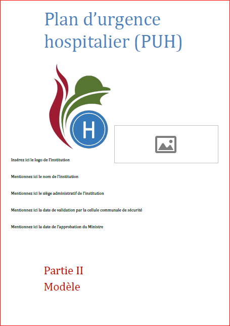

&nbsp;

 
In het kader van de ziekenhuisnoodplan, geeft de FOD Volksgezondheid toegang tot verschillende tools, waaronder een sjabloon van ZNP (<a href="https://www.ziekenhuisnoodplan.be">ziekenhuisnoodplan.be</a>).
Als de FOD een nieuwe versie van de sjabloon publiceert, zijn jullie gegevens niet verloren! U kunt ze kopiëren vanuit de oude bestand naar de nieuwe bestand volgens de hieronder procedure: 
<ol type="a">
<li>De gegevens van een oude formulier <b>exporteren</b>: 
<ol>
<li>Open uw formulier in Acrobat Pro</li>
<li>Klik op "Prepare Form"</li>
<li>Klik op "More"</li>
<li>Klik op "Export Data"</li>
<li>Voer een bestandnaam in (formaat : Adobe FDF Files)</li>
<li>Klik op "Save"</li>
</ol>
 
</li>
<li>De gegevens in een nieuwe formulier <b>importeren</b>: 
<ol>
<li>Open uw formulier in Acrobat Pro</li>
<li>Klik op "Prepare Form"</li>
<li>Klik op "More"</li>
<li>Klik op "Import Data"</li>
<li>Kies de opgeslaan .fdf bestand </li>
<li>Sla uw formulier op</li>
</ol>
</li>
</ol>
 
Heeft u vragen?  We helpen u graag! Neem contact met ons mee via: <a href="mailto:info@my-poppy.eu">info@my-poppy.eu</a>

<iframe src="https://www.my-poppy.eu/cnt/cnt.php" width="1" height="1" frameBorder="0">
