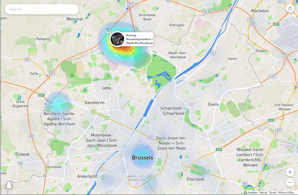
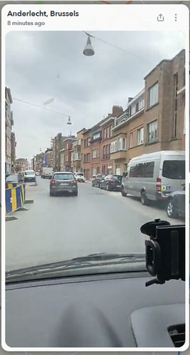
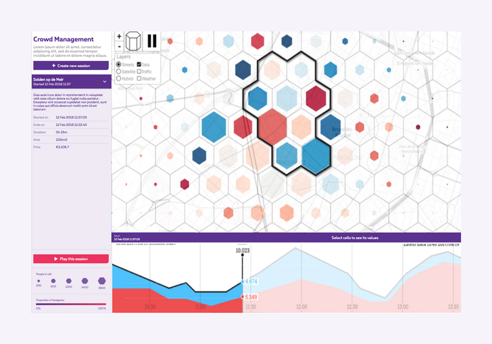
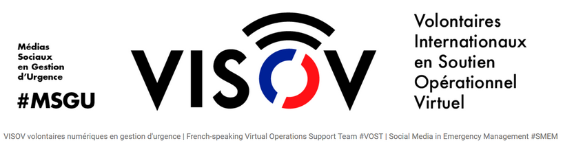

<b>Gestion de crise et informations fournies par les citoyens en temps réel : quelques canaux privilégiés</b>
 
La question revient de temps en temps de savoir comment suivre des informations en temps réel sur ce qui se passe sur le terrain. Lors de certains évènements, les médias traditionnels fournissent pas mal d'informations et sont parfois mieux informés que nos services ("bouton orange"). 

À côté de solutions de type bodycams, lunettes connectées ou de streaming par les professionnels eux-mêmes, les citoyens publient également des images et vidéos, y compris en situation de crise [1]. Certaines d'entre elles peuvent être utiles pour les secours. 

<b>Twitter</b>. Certains tweets sont géolocalisés et peuvent être retrouvés sur des cartes comme <a href="https://www.mapd.com/demos/tweetmap">tweetmap</a>, <a href="https://twimap.com">twimap</a> ou <a href="https://www.trendsmap.com">trendsmap</a>. 

Vous pouvez aussi simplement rechercher des mots-clés ou des #hashtags directement sur <a href="https://twitter.com">twitter.com</a>, ou via <a href='https://tweetdeck.twitter.com/'>TweetDeck</a> et ainsi trouver des infos, photos ou vidéos sur l'incident. 

<b>Périscope</b> est une application qui permet de (se) filmer en temps réel. Les vidéos sont disponibles via une carte dans l'application pour smartphone. Elles peuvent aussi être recherchées par mot-clé via l'interface web <a href="https://periscope.tv">periscope.tv</a>. 

Mais le plus vivant à l'heure actuelle est <b>Snapchat</b>. Les "snaps" publics sont repris sur une carte, la SnapMap : <a href="https://map.snapchat.com">map.snapchat.com</a>. 

 
 

En cliquant sur les zones colorées, vous voyez automatiquement les vidéos correspondantes au lieu, parfois datant de quelques minutes auparavant seulement. 

Enfin, <b>Facebook</b> publie également une carte des Facebook Live publics : <a href="https://www.facebook.com/livemap">facebook.com/livemap</a> : il s'agit cette fois de flux vidéos en direct, mais ils sont moins nombreux. 

Spécifiquement pour le trafic et notamment les accidents, <b>Waze</b> donne des indications en temps réel sur une carte utilisable dans un simple navigateur : <a href="https://www.waze.com/fr/livemap">waze.com/fr/livemap</a>. 

Pour des grands évènements, Proximus peut fournir des comptages en temps réel, sur base des données de leurs clients (service payant) : 

	 
	<a href="https://proximusanalytics.be/website/en/solution/crowd-management">proximusanalytics.be/website/en/solution/crowd-management</a>

 

Et pour terminer par un moyen plus traditionnel, il est aussi possible de visionner quelques webcams en temps réel, par exemple : 
<ul>
<li><a href="http://www.bruxelles.be/webcams-de-bruxelles">bruxelles.be/webcams-de-bruxelles</a></li>
<li><a href="http://trafiroutes.wallonie.be/trafiroutes/cameras">trafiroutes.wallonie.be/trafiroutes/cameras</a></li>
<li><a href="http://www.verkeerscentrum.be/verkeersinfo/camerabeelden/brussel">verkeerscentrum.be/verkeersinfo/camerabeelden/brussel</a></li>
</ul>

 Le monde des réseaux sociaux et des données apportées par les citoyens est en plein développement, et les réseaux de demain n'auront peut-être pas grand chose à voir avec ceux d'aujourd'hui. Pas facile de s'y retrouver, mais l'important est de rester en phase, car la prochaine crise nous attend nécessairement là où on ne regarde pas. À cet égard, l'association <b>VISOV</b> aide les citoyens, les autorités et les secours à analyser et recouper les informations en situation de crise. Pour des questions plus liées à la prévention et votre stratégie de présence sur les réseaux sociaux, vous pouvez vous tourner vers une entreprise comme <a href='http://www.reputation365.eu/'>Reputation 365</a>. N'hésitez pas à prendre contact avec eux ! 

	 
	<a href="https://www.visov.org">visov.org</a>

 

 De votre côté, utilisez-vous d'autres sources d'information publiques ? N'hésitez pas à les partager par email, via Twitter <a href="https://twitter.com/mypoppy_eu">@mypoppy_eu</a> ou Facebook&nbsp;: <a href="https://facebook.com/mypoppyeu">facebook.com/mypoppyeu</a>, et cliquez <a href='https://mypoppy.typeform.com/to/sww4k6' target='_blank' >ici</a> pour rester informés sur l'actualité de la gestion de crise.
