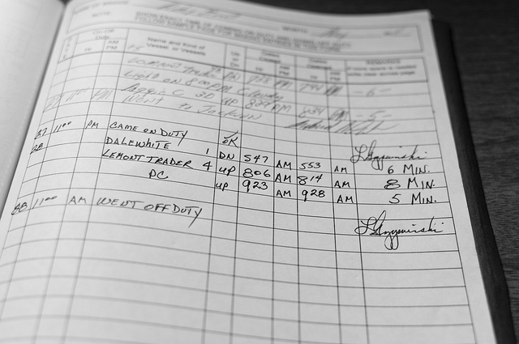

--
title: Post-crise : prouver que vous n'avez pas modifié votre logbook (1/2)
--

	
	
<i>Attention : post special pour les gestionnaires de crise geeks !</i>
 
	<b>Problématique</b>. Au cours d’un évènement ou d’une situation d’urgence, on a souvent recours à un logbook électronique pour enregistrer les décisions. Mais comment prouver que celui-ci n’a pas été modifié après coup ? Comment prouver que des instructions ont bien été données en temps utile pour prévenir une crise, ou que les plans d’urgence n’ont pas été falsifiés a posteriori ?
	   
	Même s’il est inévitable de commettre des erreurs en situation de crise (1), il importe parfois de conserver les preuves des actions réalisées en cas d'enquête ultérieure. Comment faire avec des fichiers informatiques, par essence modifiables ?
	  
	<b>Solutions</b>. Jusqu'il y a peu, à côté d'imprimer vos documents et de les mettre sous scellés, au moins trois possibilités s'offraient à vous :
		<ul>
			<li>Faire un <a href='https://www.boip.int/fr/entrepreneurs/idees/publier-un-idepot'>i-DEPOT</a> : vous <a href='https://www.boip.int/fr/entrepreneurs/idees/publier-un-idepot'>envoyez</a> vos documents et vous payez 36 € pour 5 ans. Potentiellement pas bon marché, mais cela garantit que vous déteniez bien le document soumis à une certaine date.</li> 
			<li><a href="https://support.office.com/fr-fr/article/ajouter-ou-supprimer-une-signature-num%C3%A9rique-dans-les-fichiers-office-70d26dc9-be10-46f1-8efa-719c8b3f1a2d">Signer numériquement</a> votre logbook. Grâce à des propriétés mathématiques, ce processus permet de détecter si le document a été modifié, pour autant qu’on ne vous vole pas votre « certificat ». Open Office, Microsoft Office ou encore Adobe Acrobat permettent de signer vos documents avec votre carte d'identité électronique. Bien entendu, il faut avoir la carte sous la main, se souvenir du code, et disposer d'un lecteur en état de marche. Vous devez être présent pour la signature de chaque document, et, au bout du compte, la date de signature n'est pas garantie, sauf à recourir à un processus (encore) plus complexe.</li> 
			<li>Or, dans le cas des logs, c’est la date et l’heure qui importent, et pas tellement votre signature personnelle. Vous pouvez alors vous tourner vers l'horodatage de confiance, par exemple celui de <a href="https://www.globalsign.fr/fr/horodatage/">Globalsign</a> ou d'une société comme <a href="https://www.eidcompany.be/fr/eidsign.php">eID company</a>.</li> 
		</ul>
	Ces trois solutions reposent cependant sur la confiance que vous avez dans le service de base. Pour pallier à cela, une nouvelle possibilité s'offre à vous, issue du monde des crypto-monnaies, comme celle proposée par exemple par <a href="https://originstamp.org">OriginStamp</a>.  
	<a href="https://www.youtube.com/watch?v=SSo_EIwHSd4">Vous avez dit blockchain ?</a> Elle consiste dans un premier temps à réaliser une <b>empreinte</b> de votre document. Il s’agit d’un <b>résumé numérique</b> de celui-ci tel que <b>deux documents légèrement différents ont une empreinte complètement différente</b>. Cette empreinte ne révèle absolument rien sur le contenu de votre fichier. Par exemple, l’empreinte de l’article de l'<a href="https://fr.wikisource.org/wiki/L%E2%80%99Encyclop%C3%A9die/1re_%C3%A9dition/STRATEGE" target="_blank">Enclyclopédie</a> à propos du mot "Stratège" est  
21398a73600d77c323eaa82175d23fa78c3b063762e1551f6a4398563e57b260,
 tandis que si le S initial est changé en C, elle devient   
7f8b597e01ec711f4d40653a4576df44f1ddfe70d34bf61d8c37763f208b6e16.
 

Donc, si vous modifiez le fichier, son empreinte changera radicalement. Mais comment prouver que l’empreinte, et par induction, le fichier, existait à un moment donné ?  

Il faut pour cela enregistrer cette empreinte quelque part. Les services ci-dessus le font de manière centralisée. Une « blockchain » le fait de manière décentralisée, c'est-à-dire que l'enregistrement repose sur une multitude de serveurs, ayant tous la même importance. Une blockchain est une chaîne de blocs numériques liés entre eux de sorte que modifier l'un d'eux nécessite de changer tous les suivants, et ce sur plus de la moitié des serveurs dans le monde qui l’exploitent. De plus, la modification est tellement compliquée qu’il y a peu d’intérêt à la réaliser. La blockchain la plus connue est celle du « Bitcoin », elle concerne plusieurs millions de serveurs, mais il en existe d’autres.  
Vous pouvez réaliser cette opération pour un fichier Excel, pour un fichier texte, et l'automatiser pour des enregistrements dans une base de données, comme on pourrait l'imaginer pour une plateforme comme <a href='http://icmsystem.be/french/index.html'>ICMS</a> par exemple, et cela sans risque de compromission de vos clés personnelles.  

Même si elle existe depuis plusieurs années, la technologie blockchain n'en est qu'à ses débuts "publics", et comme au début d'internet, les désillusions peuvent encore être nombreuses, mais les opportunités valent la peine qu'on s'y attarde. Si l'horodatage centralisé dépend de la confiance dans un fournisseur particulier, la technologie blockchain, décentralisée, a également ses <a href="https://www.kaspersky.fr/blog/bitcoin-blockchain-issues/9388/">inconvénients</a> (notamment en terme d'efficience énergétique), qui doivent être <a href="https://www.kaspersky.com/blog/good-good-blockchain/19575">nuancés</a>, et ce n'est pas ce post qui épuisera le sujet. Donc ici encore plus qu'ailleurs, faites confiance à votre esprit critique et <i>keep tuned</i> !

Dans le prochain article, nous verrons comment faire en pratique pour stocker une empreinte dans la blockchain du Bitcoin.  

Qu'en pensez-vous ? Cette technique peut-elle présenter un intérêt ou des risques dans le monde de la planification d'urgence et de la gestion de crise ? Avez-vous d'autres idées ? Tweetez <b>@mypoppy_eu</b> ou partagez vos idées via <a href='https://facebook.com/mypoppyeu'>Facebook</a> !

 
 

(1) Nous sommes d’accord : la planification d'urgence et la gestion de crise sont avant tout des questions humaines, de leadership, de prise de risques, d’initiative, de créativité, de travail en commun, de confiance, ... Et dans un monde toujours plus complexe et incertain, il importe de préserver et même de développer cet esprit car les solutions nouvelles aux problèmes inédits auxquels nous sommes confrontés ne sortiront pas des livres de recettes.  

Les erreurs et les contingences de la gestion de crise mériteraient à elles seules tout un post et même plus : on y parlerait des vraies erreurs et de celles qui n'en sont pas, des erreurs a priori qui se révèlent des coups de génie a posteriori, des <a href='https://fr.wikipedia.org/wiki/Biais_cognitif'>biais cognitifs</a>, des déviations par rapport à la théorie — elle-même en quelque sorte une déviation par rapport à la réalité —, de celles qui ont leur origine dans la prise de risques ; du statut du plan et de la planification, du rapport à la technique, de la peur et de l'incertitude dans de telles situations... mais d'autres en parlent bien mieux que moi :  Daniel Kahneman dans <a href='https://en.wikipedia.org/wiki/Thinking,_Fast_and_Slow'><i>Thinking, Fast and Slow</i></a>, Patrick Lagadec dans <a href="https://hal.archives-ouvertes.fr/hal-00422147/document"><i>La question des plans</i></a>, Edgar Morin avec <a href="https://www.lesechos.fr/27/05/2014/LesEchos/21696-159-ECH_edgar-morin-----la-pensee-complexe-aide-a-affronter-l-erreur--l-illusion--l-incertitude-et-le-risque--.htm/"><i>La pensée complexe aide à affronter l'erreur [...]</i></a>, Jean-Marc Baquet dans sa conférence sur l'<a href="https://www.youtube.com/watch?v=Ewsk5fr0xe8"><i>incertitude à l'armée</i></a>, Vincent Desportes dans son livre <a href="https://www.persee.fr/doc/polit_0032-342x_2005_num_70_1_1099_t1_0199_0000_4"><i>Décider dans l'incertitude</i></a>, ou encore Philippe Vallat dans son post <a href='http://www.comitans.ch/fr/component/content/article/39-blog-philippe-vallat/leadership-dans-l-incertitude/145-la-peur'><i>Zones d’inconfort et ancres de certitude</i></a>.  

Tant qu’elles ne constituent pas une faute, les inévitables erreurs commises en gestion de crise doivent pouvoir être évaluées au regard du caractère exceptionnel de la situation et notamment du brouillard ambiant (qu'il soit de la guerre comme celui de Clausewitz, de la crise, ou de toute situation nouvelle à enjeu), et leurs origines décodées en profondeur afin qu’elles servent de marches-pieds pour mieux aborder le futur.  

C'est en tout cas dans cet esprit que j'inscris mon travail, afin que la technique soit au service des personnes confrontées à ces situations, et non l'inverse.
 

 (2) Crédits photos: 
&nbsp;&nbsp;&nbsp;(a) <a href="https://unsplash.com/photos/yFbyvpEGHFQ">John Schnobrich</a> sur Unsplash 
&nbsp;&nbsp;&nbsp;(b) <a href="https://commons.wikimedia.org/wiki/File:Czech_office_timestamp.jpg">Jirí Sedlácek (Frettie)</a> sur Wikimedia 
&nbsp;&nbsp;&nbsp;(c) <a href="https://www.flickr.com/photos/vxla/5779530912">vxla</a> sur Flickr

	 

