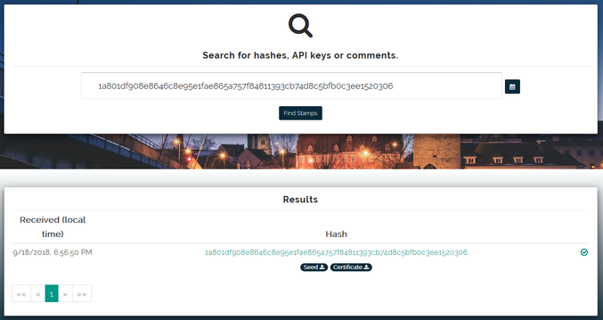

<i>Attention : post special pour les gestionnaires de crise geeks !</i>
 
Le mois passé, nous avons vu quelques possibilités de prouver que votre logbook n'a pas été modifié après la situation de crise, dont l'une basée sur la technologie blockchain. Alors, comment faire en pratique ?  
	
	1. choisissez un fichier sur votre disque dur, par exemple une image 
	2. rendez-vous sur <a href="https://originstamp.org/">originstamp.org</a> 
	3. glissez votre fichier dans le carré blanc 
	4. cliquez sur "STAMP" 
	5. Un nouveau lien apparaît dans la barre d'adresse. Copiez-en la partie après la dernière "/" (ex : 555b11ccc45cc934790a78007768a4fae722014bb6b5fd24086fa1ba01f6367a) 
	Au maximum 24 h plus tard, l'empreinte sera "gravée dans le marbre" de la blockchain du Bitcoin. Cela signifie qu'elle sera envoyée sur de nombreux serveurs de la planète, et qu'un processus informatique garantira qu'en pratique personne ne pourra altérer cette information.  

	Si dans le futur quelqu'un souhaite vérifier que le fichier existait bien à la date que vous prétendez, il recalculera l'empreinte (il obtiendra la même que ci-dessus, par exemple 555...367a), puis la soumettra sur <a href='https://originstamp.org/timestamps'>originstamp.org/timestamps</a>. Il verra alors la date et l'heure à laquelle vous avez soumis le document. Si une <i style="color:orange" class="fa fa-clock-o"></i> apparaît, votre empreinte est encore en file d'attente. Revenez 24 h plus tard, un <i style="color:darkgreen" class="fa fa-check-circle-o"></i> apparaîtra pour dire que votre empreinte est enregistrée dans la blockchain du Bitcoin. Vous pouvez alors télécharger un certificat qui l'atteste.   
	La magie est que si Originstamp venait à disparaître, il sera toujours possible de vérifier l'empreinte, selon la procédure indiquée dans le certificat.  
	Qu'en pensez-vous ? Cette technique peut-elle présenter un intérêt ou des risques dans le monde de la planification d'urgence et de la gestion de crise ? Avez-vous d'autres idées ? Tweetez <b>@mypoppy_eu</b> ou partagez vos idées via <a href='https://facebook.com/mypoppyeu'>Facebook</a> !

	<b>Pour les geeks</b> : votre fichier ne sera pas transmis au serveur. Cependant, pour encore plus de certitude, vous pouvez aussi calculer l’empreinte vous-même. Par exemple, sous Windows, il faut suivre les étapes suivantes : 
	<ol>
	<li>ouvrez une invite de commande (cmd)</li>
	<li>navigez jusqu'au dossier où se trouve votre fichier (avec cd)</li>
	<li>tapez certUtil -hashfile votre_fichier.txt SHA256</li>
	<li>prenez la seconde ligne qui s'affiche</li>
	<li>effacez tous les espaces</li>
	</ol>
	Cela donne par exemple : 555b11ccc45cc934790a78007768a4fae722014bb6b5fd24086fa1ba01f6367a 
	Copiez-collez ensuite l'empreinte sur le serveur (<a href='https://originstamp.org/home/create/hash'>originstamp.org/home/create/hash</a>)

Photo by João Silas <a href='https://unsplash.com/photos/I_LgQ8JZFGE'>Unsplash</a>

