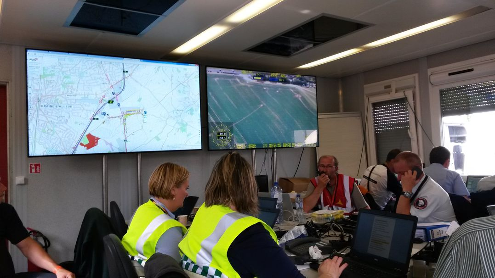

Poppy is regelmatig gesolliciteerd om een cartografische steun aan evenementen te brengen, zowel voor de productie zelf, als voor bepaalde onderdelen zoals de logistiek of de mobiliteit. In december 2018 hebben we de gelegenheid gehad om enkele [zichten met de studenten evenement management](https://docs.my-poppy.eu/20181203_carto_101_charles_peguy_pour_diffusion.pdf) te delen in het kader van het cursus evenement veiligheid van Th. Van Keisbilck ([360 solutions](https://www.360-solutions.eu/)) bij het [Charles Peguy instituut](https://www.charlespeguy.be/formations/creation-devenements/).

In een wereld die exponentieel complexer wordt, zijn tools om informatie fluxen te vereenvoudigen elke dag meer nodig. Te vaak zijn beslissingen nog genomen zonder dat de andere betrokkene partijen het weten. En hoe vaak wordt nog informatie uitgewisseld op onleesbare screenshots en wat kan het als gevolg op de veiligheid van de toeschouwers hebben?

Hulpdiensten werken steeds meer multidisciplinair (cf tools zoals de [multidisciplinair aanvraag formulier](https://be.brussels/siamu/bibliotheque-multimedia/fichiers/organiser-un-evenement-que-faire/fiche-signaletique), [ICMS](http://icmsystem.be/dutch/index.html), ...). Organisatoren kunnen zeker opvallen door informatie in praktische formaten met de overheid uit te wisselen.

  
CAD (<i>Computer Assisted Design</i>) tools ([AutoCAD](https://www.autodesk.com/products/autocad/overview), [QCAD](https://www.qcad.org/en/), ...) zijn perfect voor de technische conceptie van evenementen, door elk klein nagel te klaten tekenen, maar wanneer het tot multiorganisatie samenwerking komt, komen andere tools op het podium. 

Voor kleine evenementen, tools zoals [UMap](https://umap.openstreetmap.fr/fr/) of [Google My Maps](https://www.google.com/maps/d/) helpen om een gemeenschappelijke cartografie (organisator, hulpdiensten, overheid) te maken, maar hun beperkingen worden snel bereikt. Voor grootschalige evenementen, professionele GIS (<i>Geographical Information systems</i>) tools ([QGIS](https://www.qgis.org/en/site/), [ArcGIS](https://www.arcgis.com/index.html), [MapInfo](https://www.pitneybowes.com/us/location-intelligence/geographic-information-systems/mapinfo-pro.html), ...) hebben de kracht om complex projecten te beheren.

  
In elk geval, een gemeenschappelijke cartografische  overzicht brengt onder andere;

- een  **betere voorbereiding** voor iedereen door:
    -   **gemakkelijker zien of alles coherent is** door de informatie van elk partij op eenzelfde kaart te tonen (bv circulatieposten van de politie vs trafiek maatregelen);  
    -  op voorhand over dezelfde accurate kaarten te beschikken voor schriftelijke en mondelinge briefings; 

-   een **betere coördinatie** tijdens het evenement, en sneller beslissingen nemen als er iets gebeurd (lokaal of grootschalig) door:
    -   **eenzelfde kaart** in de verschillende plaatsen te vinden: monodisciplinair commandoposten, crisiscenter, organisator commandopost, ... Het wordt dus gemakkelijker te communiceren ;
    -   **dezelfde woorden voor de zelfde concepten** gebruiken (ervoor zorgen dat er geen twee ingangen "A" zijn, of dat de politie en de organisator de zelfde benaming voor dezelfde ingang gebruiken) ;
    -   iedereen baseert zijn beslissingen op het meeste accurate, **meeste recente gegevens**.  
         
-   een beter beheer door de geplande dispositief te kunnen vergelijken met de realiteit, door **de mogelijkheid van externe info te integreren**, o.a. :  
    -   trafiek (bv: Be Mobile, HERE, Waze, Google Maps);  
    -   crowd te integreren (grootschalig: Proximus of Orange, of kleinschalig: camera, Bluetooth & Wifi sensoren);
    -   geolokalisatie van bepaalde personen, voertuigen en goederen, ...
    
CAD plannen en andere data bronnen kunnen in GIS tools geïntegreerd worden, en die cartografische tools laten dan toe om gegevens te leveren in de meeste gepaste formaat voor de persoon die het zal gebruiken: 
- accurate papier kaarten;
- interactieve web kaarten;
- KML bestanden, ... 

Bij voorbeeld is het dan mogelijk om de gegevens te integreren **in een tool zoals ICMS**, dat FOD Binnenlandse Zaken ter beschikking stelt voor crisis en grote evenementen management. Door (een deel van) de gegevens in dit systeem in te voeren zijn dan al de betrokkene partijen (dienst 112, dienst 101, geimpacteerde gemeenten, Gouverneur / Hoge ambtenaar, ...) automatisch op de hoogte van de toestand.

In kort, zelfs als de kaart en de realiteit nog verschillend zijn, biedt cartografie een coherent zicht over het geheel, zodanig dat de jullie beter op voorhand kunnen plannen en sneller beslissingen kunnen nemen zou er iets gebeuren.

En jullie, hoe pakken jullie de complexiteit van jullie evenementen aan?

<iframe src="https://www.my-poppy.eu/cnt/cnt.php" width="1" height="1" frameBorder="0">
