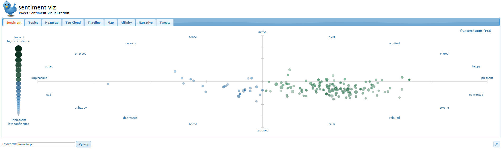
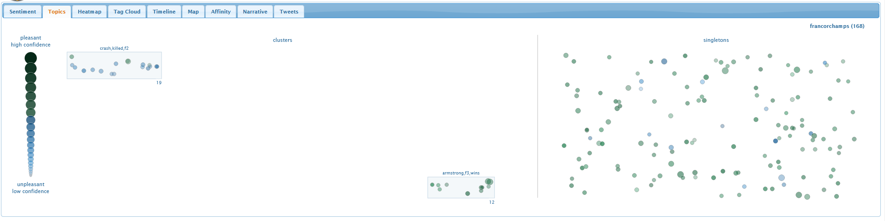
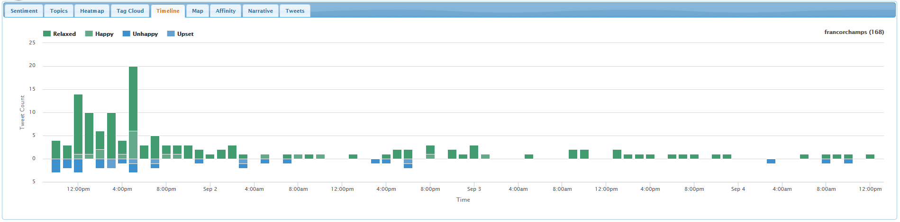

En gestion d'évènement comme en situation de crise, il est crucial d'analyser et de comprendre le ressenti des participants ou de la population, afin de pouvoir y répondre adéquatement et/ou de mesurer l'efficacité des mesures prises.

À côté d'outils commerciaux comme par exemple <a href='https://blog.hootsuite.com/social-media-sentiment-analysis-tools/'>Hootsuite</a>, <a href='https://mention.com/en/sentiment-analysis/'>Mention</a>, ou encore <a href='https://sproutsocial.com/insights/sentiment-analysis/'>Sproutsocial</a>, il existe un petit outil en ligne gratuit, et surtout très simple, développé par la <a href='https://www.ncsu.edu/'>NC State University</a> : <a href='https://www.csc2.ncsu.edu/faculty/healey/tweet_viz/tweet_app/'>SentimentViz</a>.

Tapez simplement un terme de recherche (p. ex. ici : "francorchamps") et cliquez sur "query". Vous obtenez après quelques secondes un graphe qui vous indique si les tweets sont plutôt positifs ou négatifs (axe horizontal), et si leur émotion est plutôt contenue ou fort exprimée (axe vertical).

Grâce à l'onglet "Topics", vous pouvez identifier les sujets qui sont à l'origine de certains sentiments. Par exemple, à Francorchamps cette année, le décès tragique du pilote Anthoine Hubert (en haut à gauche) :

La timeline, quant à elle, vous donne un aperçu de l'évolution du nombre de tweets et de leurs sentiments :

Bien entendu, les résultats d'une telle analyse automatique sont toujours à prendre avec précaution : un algorithme a par exemple des difficultés à détecter des moyens d'expression comme l'ironie.

Et vous, comment utilisez-vous les réseaux sociaux en situation de crise ? Privilégiez-vous certains outils ? Qu'est-ce qui est important pour vous ?

<iframe src="https://www.my-poppy.eu/cnt/cnt.php">
<iframe src="https://www.lesoir.be">
