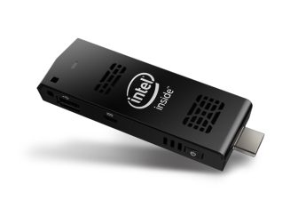
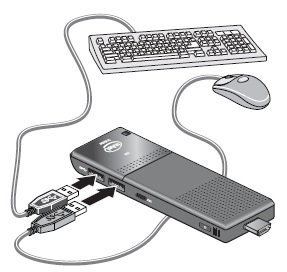

Vous n'envisagez pas de vous séparer de vos données, et en même temps, vous ne pouvez pas transporter votre PC partout ? Vous avez déjà étudié la piste de l'ultraportable (moins d'1,5 kg), ou de la tablette, et c'est encore trop encombrant ? Vous savez que, où que vous alliez, vous aurez à votre disposition un écran avec une prise HDMI, tel qu'un téléviseur, un projecteur ou un écran de PC, ainsi qu'un clavier et une souris (c'est risqué, mais sait-on jamais) ?

Alors l'[Intel Compute Stick](https://www.intel.fr/content/www/fr/fr/products/boards-kits/compute-stick.html) ou le [Asus PC Stick](https://www.asus.com/fr/Stick-PCs/) sont peut-être fait pour vous.

Dans 11,5 cm, un tel ordinateur [a (presque) tout d'un grand](https://www.makeuseof.com/tag/buying-an-intel-compute-stick-7-pros-and-cons-you-must-know/), pour un montant variant entre 151 et 621 €. Comme quoi ce n'est pas toujours la taille qui compte !

Branchez-le sur une prise HDMI, et dans une prise électrique ou sur votre powerbank, connectez un clavier et une souris, et vous êtes prêt.

 
Il existe une alternative "open source" : [Raspberry Pi](https://www.raspberrypi.org/).

L'important est de disposer d'un outil qui vous convient et que vous maîtrisez. À titre personnel, je préfère l'ultraportable, qui permet d'intervenir à tout endroit sans dépendre de matériel externe, mais vous, qu'en pensez-vous ?

