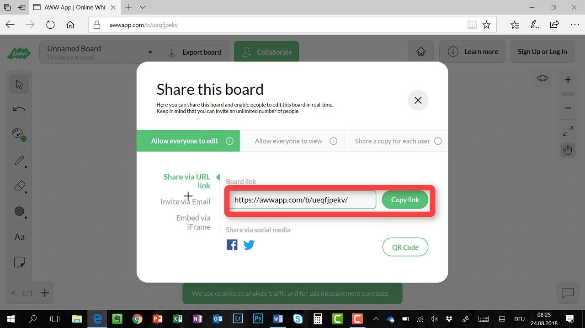

Voici une petite liste d'outils collaboratifs qui peuvent s'avérer utiles en gestion de crise, complémentaires des outils dédiés tels que le [portail national de sécurité](https://centredecrise.be/fr/content/le-portail-de-securite). 

Pour en tirer le meilleur parti, testez-les au préalable, et si possible, **utilisez-les au quotidien**. Attention, ces services, souvent gratuits ou à bas coût, n'apportent aucune garantie de service. On a donc à la fois avantage à apprendre à s'en servir pour être plus efficaces, et à apprendre à s'en passer le jour où ils sont indisponibles. 

Vérifiez au préalable que leurs conditions d'utilisation sont alignées avec les objectifs et valeurs de votre institution. Les versions **open-source** sont parfois moins conviviales, mais permettent un **meilleur contrôle** de vos données en autorisant l'installation sur les serveurs de votre institution. La notion de **chiffrement de bout en bout** signifie que les données sont chiffrées sur le serveur et que ce dernier est incapable de déchiffrer vos informations par lui-même.

-   **Vidéoconférence** : grv.to et whereby.com (voir aussi [ce post](https://blog.my-poppy.eu/Videoconference/)). Établissez une vidéoconférence avec plusieurs personnes au moyen d'un simple lien. Votre correspondant.e n'a pas besoin de login ou de mot de passe. Avec whereby.com, vous pouvez même demander aux personnes qui rejoignent la conversation de « frapper à la porte » et de montrer leur visage. Vous décidez alors si vous les laissez entrer ou non.

-   **Tableau blanc** : awwapp.com - tout ce que vous dessinez est automatiquement reproduit en temps réel chez les personnes à qui vous partagez le lien. Pour une version open-source et chiffrée de bout en bout, vous pouvez utiliser cryptpad.fr/whiteboard par exemple.

-  **S'organiser de manière agile** : trello.com (pour un analogue open-source et chiffré de bout en bout : cryptpad.fr/kanban). Vous pouvez l'utiliser comme une todo-liste géante partagée. Les colonnes seraient alors par exemple « *idées* »,  « *à faire* », « *en cours* », « *terminé* ». Chaque carte représente une action, que vous pouvez changer de colonne à votre guise, un peu comme un post-it. Par exemple, lorsque vous commencez une action, passez-là de la colonne « *à faire* » à « *en cours* ». Tous vos collaborateurs sauront que vous prenez cette action en charge.

- **Collaborer en temps réel sur un document** : à côté du classique Google Docs, vous trouverez aussi [CryptPad ](https://cryptpad.fr) (open source et chiffré de bout en bout). 

	Au besoin, utilisez la version « code » (cryptpad.fr/code/), ou l'outil hackmd.io pour faciliter le formattage du texte grâce à la syntaxe « [markdown](https://fr.wikipedia.org/wiki/Markdown#Formatage) », comme sur [Whatsapp](https://blog.my-poppy.eu/Whatsapp/). Exemple : *italique* s'écrit `*italique*` et **gras** s'écrit `**gras**`.

- **Partager des mots de passe avec une équipe** : utilisez un gestionnaire de mots de passe collaboratif tel que dashlane.com. Plus besoin d'envoyer les mots de passe par email. Chacun.e n'a qu'un seul mot de passe à retenir pour accéder au site. Lorsque la personne ne fait plus partie de l'équipe, vous pouvez simplement désactiver son compte (et au besoin, changer les mots de passe). Attention à prévoir une solution de secours au cas où, par malchance, le site ne serait plus accessible.

- **Partager des fichiers** : votre institution dispose probablement déjà d'un outil de partage de fichiers. À défaut, utilisez de préférence un outil professionnel tel que box.com, qui protège mieux vos données que Dropbox ou Google Drive, notamment en permettant de définir des liens partageables pour une durée limitée. Tresorit.com et spideroak.com vous permettent, eux, un stockage chiffré de bout en bout, tandis que des outils comme seafile.com, pydio.com, nextcloud.com ou encore alfresco.com vous permettent, par leur caractère open-source, de gérer les fichiers sur les serveurs de votre institution.

- [Slack](https://slack.com/), [Teams](https://teams.microsoft.com/start), ou encore [Mattermost](https://mattermost.com/) pour leur version open-source, sont aussi des outils fantastiques pour **s'organiser en groupe**, mais plus complexes à utiliser.

-  Enfin, vos **outils habituels** sont aussi accessibles via le web, comme par exemple : web.skype.com, web.whatsapp.com et web.telegram.com.

Et vous, quels outils utilisez-vous ? Pour aller plus loin, contactez-nous pour une analyse de besoins et des conseils adaptés à votre situation !

<iframe src="https://www.my-poppy.eu/cnt/cnt.php" width="1" height="1" frameBorder="0">

